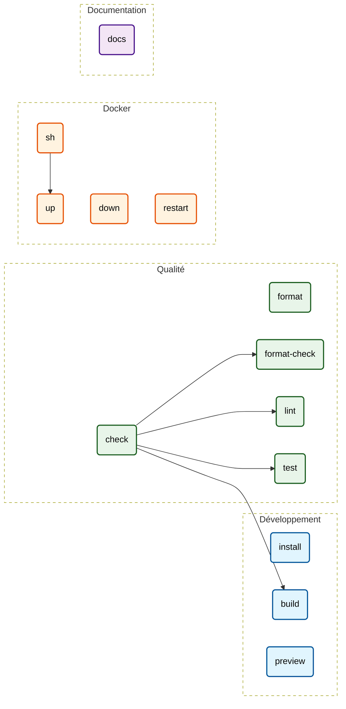

# Makefile Documentation
> *Auto-generated by [makefile2doc](https://github.com/Merlin-Clos/makefile2doc)*

## Cheat Sheet
| Command | Category | Description |
| :--- | :--- | :--- |
| [`make install`](#cmd-install) | [Développement](#cat-d-veloppement) | Installer les dépendances dans le conteneur Bun. |
| [`make build`](#cmd-build) | [Développement](#cat-d-veloppement) | Construire le site pour la production dans Docker. |
| [`make preview`](#cmd-preview) | [Développement](#cat-d-veloppement) | Prévisualiser le build de production sur le port 4173. |
| [`make format`](#cmd-format) | [Qualité](#cat-qualit) | Appliquer le formatage Oxfmt dans Docker. |
| [`make format-check`](#cmd-format-check) | [Qualité](#cat-qualit) | Vérifier le formatage Oxfmt sans modifier les fichiers. |
| [`make lint`](#cmd-lint) | [Qualité](#cat-qualit) | Lancer Oxlint strict dans Docker. |
| [`make test`](#cmd-test) | [Qualité](#cat-qualit) | Lancer les tests Vitest dans Docker. |
| [`make check`](#cmd-check) | [Qualité](#cat-qualit) | Exécuter les vérifications de format, lint, tests et build. |
| [`make up`](#cmd-up) | [Docker](#cat-docker) | Démarrer le serveur avec hot reload, disponible sur localhost:5173. |
| [`make down`](#cmd-down) | [Docker](#cat-docker) | Arrêter les conteneurs du projet. |
| [`make restart`](#cmd-restart) | [Docker](#cat-docker) | Redémarrer les conteneurs du projet. |
| [`make sh`](#cmd-sh) | [Docker](#cat-docker) | Ouvrir un shell dans le conteneur Bun en cours d’exécution. |
| [`make docs`](#cmd-docs) | [Documentation](#cat-documentation) | Générer docs/MAKEFILE.md depuis les commentaires du Makefile. |

---

## Workflow Graph

---

## Section Details

### Développement
| Command | Description | Dependencies | Required Variables |
| :--- | :--- | :--- | :--- |
| `make install` | Installer les dépendances dans le conteneur Bun. | - | - |
| `make build` | Construire le site pour la production dans Docker. | - | - |
| `make preview` | Prévisualiser le build de production sur le port 4173. | - | - |

### Qualité
| Command | Description | Dependencies | Required Variables |
| :--- | :--- | :--- | :--- |
| `make format` | Appliquer le formatage Oxfmt dans Docker. | - | - |
| `make format-check` | Vérifier le formatage Oxfmt sans modifier les fichiers. | - | - |
| `make lint` | Lancer Oxlint strict dans Docker. | - | - |
| `make test` | Lancer les tests Vitest dans Docker. | - | - |
| `make check` | Exécuter les vérifications de format, lint, tests et build. | `format-check`, `lint`, `test`, `build` | - |

### Docker
| Command | Description | Dependencies | Required Variables |
| :--- | :--- | :--- | :--- |
| `make up` | Démarrer le serveur avec hot reload, disponible sur localhost:5173. | - | - |
| `make down` | Arrêter les conteneurs du projet. | - | - |
| `make restart` | Redémarrer les conteneurs du projet. | - | - |
| `make sh` | Ouvrir un shell dans le conteneur Bun en cours d’exécution. | `up` | - |

### Documentation
| Command | Description | Dependencies | Required Variables |
| :--- | :--- | :--- | :--- |
| `make docs` | Générer docs/MAKEFILE.md depuis les commentaires du Makefile. | - | - |
